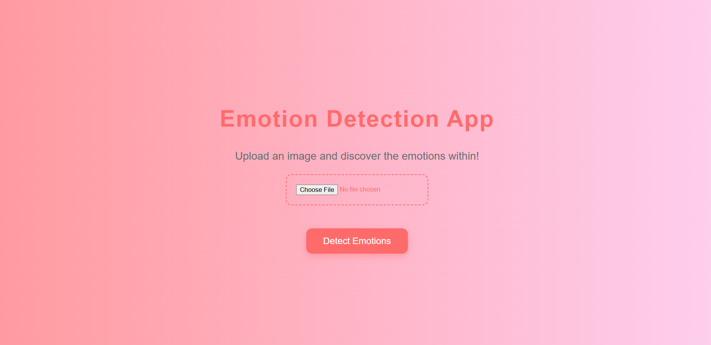
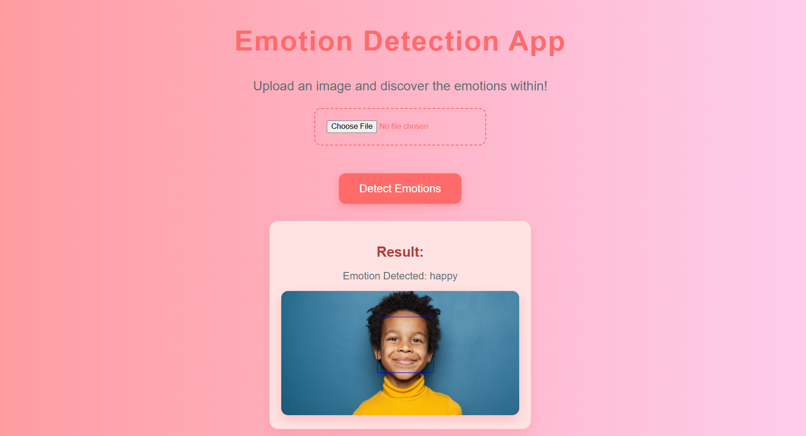

# 😊 Emotion Detection Web App

This is a Flask-based web application that detects **human emotions** from images using deep learning. Upload an image with a human face, and the app will predict the emotion expressed.

---

## 📷 Demo

<p align="center">
  
</p>

<p align="center">
  
</p>

---

## 🧠 Features

- Upload images via a clean, simple interface  
- Detects faces automatically  
- Classifies emotions into 7 categories:
  - `angry`
  - `disgust`
  - `fear`
  - `happy`
  - `neutral`
  - `sad`
  - `surprise`
- Shows the detected emotion label along with annotated image  

---

## 🛠️ Technologies Used

- Python 3.8  
- Flask  
- OpenCV  
- TensorFlow / Keras  
- HTML & CSS  

---

## 📁 Project Structure

```

emotion-detection-app/
├── app/
│   ├── static/
│   │   ├── css/
│   │   └── uploads/           # Uploaded and result images
│   └── templates/
│       └── index.html         # Main webpage
├── trained\_models/
│   └── emotion\_model.h5       # Pretrained emotion detection model
├── train.py                   # Model training script (optional)
├── main.py                    # Flask application entry point
├── requirements.txt           # Python dependencies
└── README.md

````

---

## 🚀 Getting Started

### 1. Clone the repository

```bash
git clone https://github.com/Raviteja0405/EmotionDetectionSystem.git
cd EmotionDetectionSystem
````

### 2. (Optional but recommended) Create and activate a virtual environment

```bash
python -m venv venv
# On Windows:
venv\Scripts\activate
# On Mac/Linux:
source venv/bin/activate
```

### 3. Install dependencies

```bash
pip install -r requirements.txt
```

### 4. Run the Flask app

```bash
python main.py
```

Open your browser at `http://127.0.0.1:5000/`

---

## 🧪 Dataset Format (if training)

Dataset should be organized as:

```
dataset/
├── train/
│   ├── angry/
│   ├── happy/
│   └── ...
└── test/
    ├── angry/
    ├── happy/
    └── ...
```

You can use the [FER2013 dataset on Kaggle](https://www.kaggle.com/datasets/msambare/fer2013) or similar.

---

## 📸 How to Use

1. Upload an image with a clear human face.
2. The app detects the face and predicts the emotion.
3. The result page displays the detected emotion and annotated image.

---

## 📦 Recommended .gitignore

```
__pycache__/
*.py[cod]
venv/
.env
*.log
.DS_Store
*.swp
*.h5
app/static/uploads/
static/uploads/
trained_models/
```

---

## 🧑‍💻 Author

Made with ❤️ by Ravi Teja
[GitHub](https://github.com/Raviteja0405)

---

## 📝 License

This project is licensed under the MIT License.